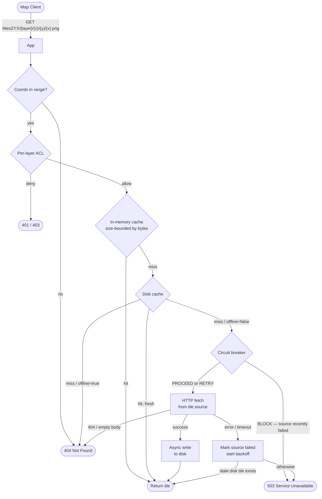

# XYZ Tile Cache

A caching proxy for map tiles. It sits between your map client and any tile source, serving cached tiles from local disk on subsequent requests and switching to a fully offline mode when no network is available.

Capabilities:

- Raster tile sources — XYZ (standard slippy map), WMTS-REST, and WMTS-KVP.
- Time-aware sources — weather radar, daily satellite imagery (URL `{time}` substitution or WMTS `TIME` dimension).
- User-uploaded local layers — upload a GeoTIFF and the proxy tiles it with `gdal2tiles` and serves it as a `LOCAL` layer.
- Vector tiles — `VECTOR_PMTILES` layers served from a local or remote PMTiles source; areas can be preloaded on demand via a normal preload that includes the vector layer, and per-layer `initZoom > 0` triggers a world-covering download at startup.
- Authenticated layer management — JSON-driven CRUD with Keycloak (JWT) or a single shared admin token, plus per-layer ACLs.
- Tile import/export — download a portable zip of cached raster tiles and/or cached vector tiles (optionally clipped to a bounding box), then re-import it on any other instance. Per-layer ACLs are enforced on both endpoints.
- Startup auto-import — drop zip files into a watched directory and the proxy ingests them on boot, skipping files it has already processed.
- A web UI on `/` for browsing layers, triggering preloads, managing layers, and importing/exporting tiles (toggleable).

## How It Works



On a cache miss the loader first checks disk, then the circuit breaker state, then makes an outbound HTTP request. Successful tiles are written to disk asynchronously so the response is not delayed.

Key behaviours:

- **In-memory cache** — a size-bounded [Caffeine](https://github.com/ben-manes/caffeine) cache keyed by layer id + coordinates (default budget `xyz.tileCacheBytes`, 256 MiB), so layer edits never orphan cached tiles.
- **Circuit breaker** — a source that returns errors or times out is blocked with exponential backoff (100 ms → 60 s) to avoid hammering unavailable upstreams; while blocked the layer answers `503`. An upstream `404` or empty body is *not* a failure (it is normal for tiles outside a source's coverage), so it never trips the breaker.
- **Stale-if-error** — when a disk tile has expired (`tileExpirationMinutes`) but the upstream refresh fails or the breaker is open, the stale tile is served rather than an error. In offline mode the expiry check is skipped entirely.
- **Coordinate validation** — `z`, `x`, `y` outside the valid range for the zoom level return `404` before any upstream request is made.

## Configuration

All settings live in `application.yml`. Mount your own file at `/app/application.yml` inside the container to override the defaults shipped in the image.

Spring Boot maps any property to the matching environment variable using its standard rules (`xyz.auth.mode` → `XYZ_AUTH_MODE`, `xyz.baseTileDirectory` → `XYZ_BASETILEDIRECTORY`, etc.), so most tuning can be done with `-e` flags without remounting a config file.

### Core settings

```yaml
server:
  port: 8383                       # listening port

spring:
  servlet:
    multipart:
      max-file-size: 2GB           # cap on GeoTIFF uploads
      max-request-size: 2GB

xyz:
  baseTileDirectory: "/tmp/tiles"  # root directory for the tile disk cache
  minFreeDiskBytes: 1073741824     # stop caching new tiles when free disk drops below this (default 1 GB)
  offline: false                   # true = serve from disk only, never make outbound requests
  tileTimeoutSeconds: 5            # per-request timeout for outbound tile fetches
  tileCacheBytes: 268435456        # in-memory tile cache budget in bytes (default 256 MiB)
  defaultCacheMaxAgeSeconds: 86400 # Cache-Control max-age for tiles with no tileExpirationMinutes
  preloadConcurrency: 4            # parallel tile fetches per preload job
  layerSyncSeconds: 10             # how often to re-read layers.json so multiple instances stay in sync
  exportRetentionMinutes: 60       # how long a finished export stays downloadable before it is swept
  exportSweepSeconds: 300          # how often the export sweeper runs
  maxImportBytes: 10737418240      # cap on total decompressed bytes accepted by POST /import (default 10 GiB)
  uiEnabled: true                  # set to false to disable the web UI (UI paths return 404)
  adminRole: admin                 # Keycloak realm role required for write operations
  importDirectory: "/app/imports"  # directory scanned for zip files to auto-import on startup
```

`importDirectory` is scanned once at startup. Any `*.zip` file not yet listed in `{importDirectory}/.imported` is ingested as the admin user, then recorded in `.imported` so it is not re-processed on the next start. If the directory does not exist, startup imports are skipped. Set the property to an empty string to disable startup imports entirely.

`minFreeDiskBytes` is a floor on free disk space. The proxy keeps writing tiles until the underlying filesystem has less than this many bytes free, then stops accepting new tiles; existing tiles are still served. The same floor guards `POST /import`.

`tileCacheBytes` bounds the in-memory (hot) tile cache by total tile bytes rather than a fixed tile count — larger tiles therefore evict sooner. It is independent of the on-disk cache, which is bounded only by `minFreeDiskBytes`.

`defaultCacheMaxAgeSeconds` sets the `Cache-Control: max-age` on tile responses for layers that do not define `tileExpirationMinutes`. Layers with `tileExpirationMinutes > 0` advertise that value instead; immutable local/vector tiles advertise a one-year immutable max-age.

`layerSyncSeconds` is used when more than one instance of the proxy shares the same `baseTileDirectory` (e.g. behind a load balancer with a shared volume). All layer mutations are persisted to `{baseTileDirectory}/layers.json`; each instance polls the file at this interval and reconciles its in-memory layer map.

### Authentication

```yaml
xyz:
  auth:
    mode: jwt              # jwt | token
    adminToken: ""         # used when mode=token
    clientId: xyz-tile-cache  # OAuth2 client id reported to the UI in jwt mode

spring:
  security:
    oauth2:
      resourceserver:
        jwt:
          issuer-uri: ${KEYCLOAK_ISSUER_URI:}
```

Two auth backends are supported:

- **`jwt`** (default) — Keycloak resource-server flow. All write endpoints require a Bearer JWT; the user must hold the realm role configured in `xyz.adminRole` (default `admin`). The realm `groups` claim is used for per-layer group ACLs. Set `KEYCLOAK_ISSUER_URI` to your realm URL.
- **`token`** — a single static admin token. Anyone presenting `Authorization: Bearer <xyz.auth.adminToken>` is treated as admin. Per-layer ACLs reduce to "public reads + admin reads" because there is no per-user identity. Useful for headless deployments or when Keycloak is overkill. Leave `KEYCLOAK_ISSUER_URI` unset in this mode.

Read access is anonymous-friendly: layers with empty `allowedUsers` and `allowedGroups` lists are public, others require an authenticated principal that matches one of the entries (or the admin role).

### Layers

Layers are the tile sources the proxy knows about. Each layer needs an `id` (used in tile URLs and as the storage subdirectory), a human-readable `name` (shown in the UI), and a source URL template. If `id` is omitted, `name` is used as the id (back-compat with older configs).

#### Per-layer common fields

| Field | Default | Description |
|-------|---------|-------------|
| `id` | — | Stable identifier used in tile URLs and as the on-disk subdirectory. Must match `[A-Za-z0-9][A-Za-z0-9._-]{0,63}` (letters/digits/`.`/`-`/`_`, starting with a letter or digit). |
| `name` | — | Display name shown in the UI. |
| `sourceType` | `XYZ` | One of `XYZ`, `WMTS_REST`, `WMTS_KVP`, `LOCAL`, `VECTOR_PMTILES`. |
| `urlTemplate` | — | Source URL pattern (omit for `LOCAL`). |
| `maxZoom` | `22` (`15` for `VECTOR_PMTILES`) | Tile requests above this zoom return 404. Applied whether the layer comes from YAML or `POST /layers`. |
| `attribution` | — | Free-form string included in `GET /layers` responses. |
| `headers` | `{}` | Map of HTTP headers added to outbound tile fetches (e.g. `Referer`, `User-Agent`). |
| `tileExpirationMinutes` | `0` | Cached tiles older than this are refetched. `0` = never expire. |
| `timeFormat` | `yyyy-MM-dd'T'HH:mm:ss'Z'` | Java `DateTimeFormatter` pattern for `{time}` substitution. |
| `allowedUsers` | `[]` | Read-access ACL — usernames from the JWT `preferred_username` claim. |
| `allowedGroups` | `[]` | Read-access ACL — group names from the JWT `groups` claim. |

Empty `allowedUsers` and `allowedGroups` together mean "public layer". A layer with either list non-empty requires authentication for reads; admins always pass.

#### XYZ (standard slippy map)

```yaml
xyz:
  layers:
    - id: "osm"
      name: "OpenStreetMap"
      sourceType: XYZ                              # default, can be omitted
      urlTemplate: "https://tile.openstreetmap.org/{z}/{x}/{y}.png"
      maxZoom: 19
      attribution: "© OpenStreetMap contributors"
      headers:
        Referer: "https://myapp.example.com"
```

#### WMTS — RESTful style

```yaml
    - id: "usgs-topo"
      name: "USGS Topo"
      sourceType: WMTS_REST
      urlTemplate: "https://basemap.nationalmap.gov/arcgis/rest/services/USGSTopo/MapServer/WMTS/tile/1.0.0/USGSTopo/default/GoogleMapsCompatible/{TileMatrix}/{TileRow}/{TileCol}"
      maxZoom: 17
```

The placeholders `{TileMatrix}`, `{TileRow}`, `{TileCol}` are substituted with `z`, `y`, `x` respectively.

#### WMTS — KVP (query parameter) style

```yaml
    - id: "imagery-wmts"
      name: "World Imagery (WMTS)"
      sourceType: WMTS_KVP
      urlTemplate: "https://services.arcgisonline.com/arcgis/rest/services/World_Imagery/MapServer/WMTS"
      wmtsLayerName: "World_Imagery"
      wmtsTileMatrixSet: "EPSG:3857"     # default
      wmtsStyle: "default"               # default
      wmtsFormat: "image/png"            # default
```

The standard WMTS `GetTile` query string is built automatically from the `wmts*` properties.

#### Time-aware layers

Layers where the tile URL or WMTS request includes a date/time (weather radar, daily satellite composites):

```yaml
    # XYZ with time in the URL path
    - id: "accu-weather"
      name: "AccuWeather Radar"
      sourceType: XYZ
      urlTemplate: "https://api.accuweather.com/maps/v1/radar/globalSIR/zxy/{time}/{z}/{y}/{x}.png?apikey=YOUR_KEY"
      timeFormat: "yyyy-MM-dd'T'HH:mm:ss'Z'"
      tileExpirationMinutes: 5

    # WMTS-KVP with a TIME dimension (NASA GIBS daily MODIS imagery)
    - id: "nasa-terra-truecolor"
      name: "NASA Terra True Color"
      sourceType: WMTS_KVP
      urlTemplate: "https://gibs.earthdata.nasa.gov/wmts/epsg3857/best/wmts.cgi"
      wmtsLayerName: "MODIS_Terra_CorrectedReflectance_TrueColor"
      wmtsTileMatrixSet: "GoogleMapsCompatible_Level9"
      wmtsFormat: "image/jpeg"
      wmtsTime: true                          # appends &TIME={time} to the KVP request
      timeFormat: "yyyy-MM-dd"                # NASA GIBS expects YYYY-MM-DD
      tileExpirationMinutes: 1440             # daily product — expire after 24 h
```

The current time is substituted into `{time}` using the layer's `timeFormat` at request time.

#### LOCAL layers (uploaded GeoTIFFs)

`LOCAL` layers have no upstream URL — tiles are read from disk only. They are typically created by uploading a GeoTIFF to `POST /layers/geotiff` (see the API section); the proxy runs `gdal2tiles.py` against the file and writes XYZ tiles into `{baseTileDirectory}/{id}/`.

### Vector tiles (VECTOR_PMTILES layers)

Vector tile layers are configured as regular layers in `xyz.layers` with `sourceType: VECTOR_PMTILES`. The `urlTemplate` field points to the PMTiles source — either a local file path or a remote HTTPS URL. Per-layer ACL and `maxZoom` rules apply exactly as for raster layers.

```yaml
xyz:
  layers:
    - id: "protomaps"
      name: "Protomaps Vector"
      sourceType: VECTOR_PMTILES
      maxZoom: 15
      urlTemplate: "${PMTILES_SOURCE_URL:https://build.protomaps.com/{date}.pmtiles}"
      initZoom: "${XYZ_PROTOMAPS_INIT_ZOOM:0}"
```

| Field | Default | Description |
|-------|---------|-------------|
| `urlTemplate` | — | Local file path (`/var/data/basemap.pmtiles`) or remote URL (`https://…`). The `{date}` placeholder is replaced with yesterday's date (YYYYMMDD) at startup. |
| `maxZoom` | `22` | Tile requests above this zoom return 404; also the `--maxzoom` cap when `pmtiles extract` is invoked during a preload. |
| `initZoom` | `0` | When `> 0` and `urlTemplate` is a remote URL, triggers a world-covering PMTiles download at startup (zoom 0 → `initZoom`) if the output file does not yet exist. The downloaded bundle is written to `{baseTileDirectory}/{id}/`. |

PMTiles bundles for a layer are stored in `{baseTileDirectory}/{id}/`. All `.pmtiles` files found there are opened as local readers. Individually fetched remote tiles are cached at `{baseTileDirectory}/{id}/{z}/{x}/{y}.pbf`.

**Tile lookup order:** local PMTiles readers → individual tile disk cache → remote URL via HTTP range requests (if not offline). Fetched remote tiles are cached to disk asynchronously.

Override the remote source URL per environment with the `PMTILES_SOURCE_URL` env var (substituted in the YAML default above).

### Startup bounding-box preloading

Define one or more bounding boxes to fill the disk cache automatically at startup.
The proxy fetches every tile for all configured layers across zoom 0 → `maxZoom`.

> **Warning:** Only do this for small areas. For large areas use a `VECTOR_PMTILES` layer with vector preloading instead — a raster source will usually start blocking your requests before a large raster preload finishes.

```yaml
xyz:
  boundingBoxes:
    - maxZoom: 8
      north: 50.0
      south: 24.0
      east: -66.0
      west: -125.0
```

Every configured bounding box runs at startup. They are processed in parallel, and within each job tiles are fetched with up to `xyz.preloadConcurrency` concurrent requests. Preloading is slow for large areas at high zoom levels — at zoom 12, the contiguous US contains roughly 250 000 tiles per layer.

For ad-hoc preloads use the `POST /preloads` API instead; those are persisted, can be named, and can target a specific subset of layers.

## REST API

### Tile endpoints

| Method | Path | Auth | Description |
|--------|------|------|-------------|
| `GET` | `/tilesZYX/{layer}/{z}/{y}/{x}.{ext}` | per-layer | Fetch a tile (ZYX coordinate order). |
| `GET` | `/tilesZXY/{layer}/{z}/{x}/{y}.{ext}` | per-layer | Fetch a tile (ZXY coordinate order). |

Both endpoints serve raster (`.png`) and vector (`.mvt`) tiles depending on the layer's `sourceType`. The extension in the URL is accepted but not validated — the `Content-Type` is set by the handler from the tile's magic bytes.

Responses:

- `Access-Control-Allow-Origin: *` on every tile response.
- `Cache-Control` reflects the layer: `max-age=<tileExpirationMinutes>` (or `defaultCacheMaxAgeSeconds` when unset), `immutable` for local/vector tiles, and `public`/`private` matching the layer's ACL.
- `401` for anonymous requests against a private layer; `403` when an authenticated principal lacks access.
- `404` for a coordinate outside the valid range for its zoom, above the layer's `maxZoom`, or absent upstream. `503` when the source's circuit breaker is open (unless a stale disk tile can be served).

### Layer management

| Method | Path | Auth | Description |
|--------|------|------|-------------|
| `GET` | `/layers` | none (filtered) | List configured layers. The response contains only layers the caller can read. |
| `POST` | `/layers` | admin | Add a new layer (JSON body matching the `Layer` schema). 409 on duplicate id; 400 on an invalid id or missing `urlTemplate`. |
| `PUT` | `/layers/{id}` | admin | Replace an existing layer. 404 if missing. |
| `DELETE` | `/layers/{id}` | admin | Remove a layer and delete its cached tiles from disk. |
| `POST` | `/layers/geotiff` | admin | Multipart upload (`name`, `file`, optional `allowedUsers`, `allowedGroups`). Tiles the GeoTIFF with `gdal2tiles.py` and registers it as a `LOCAL` layer. |

Layer changes are persisted immediately to `{baseTileDirectory}/layers.json` and survive restarts. On first startup the file is created from the layers defined in `application.yml`; subsequent restarts (and other instances pointed at the same volume) load from this file instead.

### Preloads

The current preload model is a first-class entity with its own ACL.
Legacy `POST /preload` is still accepted for back-compat but does not persist a record.

For larger ares use protomaps vector layer. If the area is too large (too many tiles) it's likely the raster tile source will start blocking your requests.

| Method | Path | Auth | Description |
|--------|------|------|-------------|
| `GET` | `/preloads` | none (filtered) | List persisted preloads visible to the caller. |
| `POST` | `/preloads` | admin | Create a preload (see body below). 409 if a vector download is already in progress; 400 for invalid input (e.g. a `VECTOR_PMTILES` layer with no `urlTemplate`, or an out-of-range bounding box / zoom). |
| `DELETE` | `/preloads/{id}` | admin | Remove a preload record (does not delete cached tiles). |
| `POST` | `/preload` | admin | Legacy fire-and-forget preload (not persisted). |

`POST /preloads` body:

```json
{
  "name": "philly-z14",
  "boundingBox": {
    "north": 40.1, "south": 39.8, "east": -74.9, "west": -75.3
  },
  "maxZoom": 14,
  "layers": ["osm", "esri-satellite", "protomaps"],
  "allowedUsers": [],
  "allowedGroups": ["team-imagery"]
}
```

If `layers` includes a `VECTOR_PMTILES` layer, the proxy runs `pmtiles extract` against that layer's `urlTemplate` to materialize a PMTiles bundle covering the bounding box (capped at `maxZoom`) and writes it under `{baseTileDirectory}/{layerId}/`. Only one vector download runs at a time.

### Import & Export

| Method | Path | Auth | Description |
|--------|------|------|-------------|
| `POST` | `/export` | authenticated | Submit an async export job. Returns 202 with a job-status object. |
| `GET` | `/exports` | authenticated | List export jobs submitted by the current user. |
| `GET` | `/exports/{id}` | authenticated | Get the status of a specific export job. |
| `GET` | `/exports/{id}/download` | authenticated | Download the completed export zip (removes the job after transfer). |
| `POST` | `/import` | admin | Upload a zip (same format) to seed the cache on this instance. |

Export requires an authenticated principal; import requires the admin role. Per-layer ACLs are enforced:
- **Export** — each requested layer is checked with `layerAccessService.canRead`. Admin users bypass this check; non-admin JWT users may only export layers their token grants access to.
- **Import** — each zip entry's layer is checked the same way. Importing tiles to a layer the caller cannot read returns 403 and the entire upload is rejected. Creating a brand-new layer via import additionally requires the admin role (consistent with `POST /layers`).

#### Export request body

```json
{
  "layers": ["osm", "esri-satellite", "protomaps"],
  "boundingBox": {
    "north": 40.1, "south": 39.8, "east": -74.9, "west": -75.3,
    "maxZoom": 14
  },
  "minZoom": 8,
  "maxZoom": 14
}
```

`boundingBox`, `minZoom`, and `maxZoom` are all optional. `layers` must be specified. When `boundingBox` is omitted every cached tile under each layer directory is included. `minZoom`/`maxZoom` further restrict the zoom range (clamped by each layer's `maxZoom`). Tiles not present on disk are silently skipped.

`VECTOR_PMTILES` layers are included like any other layer. Without a `boundingBox`, all `.pmtiles` bundles and individually cached `.pbf` tiles in `{baseTileDirectory}/{id}/` are included. With a `boundingBox`, `pmtiles extract` is run on each bundle to produce a cropped copy (skipped with a warning if the CLI is unavailable or fails), and individual `.pbf` tiles are filtered to the bbox.

`POST /export` returns 202 Accepted immediately with a job-status object:

```json
{ "id": "a1b2c3d4-...", "status": "PENDING", "filename": "tile-export-20260101-120000.zip", "error": null }
```

`status` cycles through `PENDING → RUNNING → DONE` (or `FAILED`). Poll `GET /exports/{id}` until `status` is `DONE`, then fetch the file from `GET /exports/{id}/download`. The download response is `Content-Type: application/zip`; the job entry is deleted after a successful download.

#### Export zip layout

```
osm/layer.json
osm/8/45/102.png
osm/8/45/103.png
...
esri-satellite/layer.json
esri-satellite/8/45/102.png
protomaps/layer.json
protomaps/region.pmtiles
protomaps/8/45/102.pbf
```

Every layer (raster or vector) occupies a top-level directory named by its id, containing `layer.json` and tile files. Raster tile files use `{z}/{x}/{y}.png` layout; `VECTOR_PMTILES` layers store PMTiles bundles as `{name}.pmtiles` and individually cached tiles as `{z}/{x}/{y}.pbf`.

#### Import response

```json
{
  "layersAdded": ["new-layer"],
  "layersSkipped": ["existing-layer"],
  "tilesWritten": 1842,
  "pmtilesImported": 1
}
```

`layersAdded` — layers registered from `layer.json` entries not already in the layer store.
`layersSkipped` — layers whose id already existed; the existing definition is kept but tiles are still written.
`tilesWritten` — total number of raster `.png` tile files and individually cached `.pbf` vector tiles written (existing tiles are overwritten).
`pmtilesImported` — number of `.pmtiles` bundles successfully written and registered.

PMTiles bundles in `{layerId}/*.pmtiles` entries are written to `{baseTileDirectory}/{layerId}/` and immediately registered for serving by the corresponding `VECTOR_PMTILES` layer.

#### Startup auto-import

Any `*.zip` files placed in `xyz.importDirectory` (default `/app/imports`) are imported automatically on startup as the admin user. The proxy records processed filenames in `{importDirectory}/.imported` and skips any file already listed there, so files are safe to leave in place across restarts.

```bash
# Copy a previously exported zip into the watched directory before starting the container
cp ~/tiles-backup.zip /path/to/imports/
docker run ... -v /path/to/imports:/app/imports xyz-tile-cache:latest
```

### Runtime config

| Method | Path | Auth | Description |
|--------|------|------|-------------|
| `GET` | `/config/offline` | none | Returns `{"offline": true/false}`. |
| `PUT` | `/config/offline` | admin | Toggles offline mode at runtime (no restart required). Body: `{"offline": true}`. |

Offline mode can also be set at startup via `xyz.offline` in `application.yml` or the `XYZ_OFFLINE` env var. The `PUT` endpoint lets you switch it on or off without restarting the container.

### Stats

| Method | Path | Auth | Description |
|--------|------|------|-------------|
| `GET` | `/stats` | none (filtered) | Per-instance tile-serve counters and free disk space. The `layers` array is filtered to the layers the caller can read, exactly like `GET /layers`. |

```json
{
  "instanceId": "12345@hostname",
  "tilesServedByInstance": 45230,
  "diskFreeBytes": 132100997120,
  "layers": [
    { "name": "osm", "tilesServedByInstance": 20000 },
    { "name": "esri-satellite", "tilesServedByInstance": 25230 }
  ]
}
```

The counters are in-memory and reset on restart. With multiple instances behind a load balancer, query each one individually and aggregate client-side.

### Auth discovery

| Method | Path | Auth | Description |
|--------|------|------|-------------|
| `GET` | `/auth/config` | none | Returns `{mode, issuerUri, clientId}` (jwt) or `{mode: "token"}` so the UI knows which login flow to use. |

## Security

### Authentication & authorization

- All `POST`/`PUT`/`DELETE` endpoints require the realm role configured in `xyz.adminRole` (default `admin`). Exceptions: `POST /export` and `POST /layers/geotiff` require only an authenticated principal.
- All `GET` endpoints are anonymous-friendly. Per-layer reads are gated by `LayerAccessService`:
  - empty `allowedUsers` *and* `allowedGroups` → public.
  - admin role → bypasses ACLs.
  - else the JWT must contain `preferred_username` in `allowedUsers` or any `groups` entry in `allowedGroups`.
- The same read ACL filters what `GET /layers`, `GET /stats`, the WMTS capabilities document, and the TileJSON endpoint expose — a caller never sees the existence of a layer they cannot read.
- In `token` mode there is no per-user identity, so private layers are effectively admin-only.

### Actuator / metrics

- `/actuator/health/**` and `/actuator/info` are public (for container health probes).
- `/actuator/prometheus` and any other actuator endpoint require the admin role, because the metrics carry per-layer identifiers and request volumes that would otherwise leak the names of private layers. Point your scraper at it with the admin token (token mode) or a service-account JWT holding the admin role, or expose management on a separate, non-public port with `management.server.port`.
- Only `health`, `info`, and `prometheus` are exposed at all (`management.endpoints.web.exposure.include`).

### Input hardening

- **Layer ids** must match `[A-Za-z0-9][A-Za-z0-9._-]{0,63}` on both `POST /layers` and import, so a layer id can never traverse outside `baseTileDirectory`.
- **GeoTIFF/PMTiles tooling** is invoked with argument lists (never a shell), and output paths are confined to `baseTileDirectory`.
- **Import** (`POST /import`) rejects zip-slip paths, caps total decompressed size at `xyz.maxImportBytes`, and refuses to write once free disk falls below `minFreeDiskBytes`.

### CORS

Every JSON and tile response sets `Access-Control-Allow-Origin: *`, allowing any origin to read public (and the caller's authorized) data. Authentication is Bearer-token only — no cookies — so this is not a CSRF vector, but if you need to restrict which origins may read tiles, front the service with a proxy that overrides the header.

## Local Keycloak (for testing the JWT flow)

```bash
docker compose up -d keycloak                   # starts Keycloak on :8080, imports the realm
bash scripts/keycloak/setup.sh                  # waits for ready, prints token-fetch curls
bash scripts/keycloak/setup.sh --reseed         # delete + re-import realm
```

Test users (all password `password`):

| User | Roles | Groups |
|------|-------|--------|
| `alice` | `admin` | `admins` |
| `bob` | — | `team-foresters` |
| `carol` | — | `team-imagery` |
| `dan` | — | — |

Token fetch:

```bash
TOKEN=$(curl -s -X POST http://localhost:8080/realms/xyz-tile-cache/protocol/openid-connect/token \
  -d grant_type=password -d client_id=xyz-tile-cache \
  -d username=alice -d password=password | jq -r .access_token)

curl -H "Authorization: Bearer $TOKEN" http://localhost:8383/layers
```

Override the issuer URI per environment with `KEYCLOAK_ISSUER_URI`.

## Build & Run

### Local build

```bash
mvn clean package
mvn spring-boot:run
```

`fmt-maven-plugin` runs in the `validate` phase and will fail the build if code is not formatted. Run `mvn fmt:format` to auto-format.

### Docker build

```bash
mvn clean package
docker build \
  --build-arg VERSION=$(mvn help:evaluate -Dexpression=project.version -q -DforceStdout) \
  -t xyz-tile-cache:latest .
```

The image bundles `gdal-tools` (for GeoTIFF tiling) and the `pmtiles` CLI (for vector preloads). No PMTiles data is baked in at build time — set `initZoom > 0` on a `VECTOR_PMTILES` layer to trigger a world download on first startup, or export tiles from a connected instance and drop the zip into `xyz.importDirectory`.

### Docker run

```bash
docker run \
  -v /path/to/tiles:/tmp/tiles \
  -v /path/to/application.yml:/app/application.yml \
  --rm --name xyz \
  -p 127.0.0.1:8383:8383/tcp \
  xyz-tile-cache:latest
```

Omit the second `-v` to use the bundled defaults (all included public sources, `/tmp/tiles` storage, JWT auth pointing at `KEYCLOAK_ISSUER_URI`).

For a quick token-mode deployment with no Keycloak:

```bash
docker run \
  -v /path/to/tiles:/tmp/tiles \
  -e XYZ_AUTH_MODE=token \
  -e XYZ_AUTH_ADMINTOKEN=changeme \
  --rm --name xyz \
  -p 127.0.0.1:8383:8383/tcp \
  xyz-tile-cache:latest
```

### Docker Compose

The bundled `docker-compose.yml` brings up Keycloak alongside the tile-cache and wires `KEYCLOAK_ISSUER_URI` and `SPRING_SECURITY_OAUTH2_RESOURCESERVER_JWT_JWK_SET_URI` so the two containers can talk:

```bash
docker compose up -d
bash scripts/keycloak/setup.sh
```

## Offline Mode

Set `xyz.offline: true` to prevent any outbound requests. The proxy will serve tiles from the local disk cache only and return 404 for anything not already cached. This is useful for field deployments or air-gapped environments where network access is unavailable. The web UI is served entirely from the application — no external CDN requests are made at runtime.

**Pre-populating the cache** before going offline:

1. **Preload API** — Run with `offline: false` and call `POST /preloads` (or configure `xyz.boundingBoxes`) to fetch and cache tiles from upstream sources. Include a `VECTOR_PMTILES` layer in the preload's `layers` set to also download a PMTiles bundle for the area, or set `initZoom > 0` on a vector layer to download a world-covering bundle at startup.

2. **Export then import** — Export a bounding box of tiles from a connected instance with `POST /export` (include any `VECTOR_PMTILES` layers to export their cached tiles and bundles), then import the resulting zip on the offline target with `POST /import` (or place the zip in `xyz.importDirectory` for automatic ingestion on the next startup).

The two approaches can be combined: preload raster tiles via the API and transfer a separate export zip for layers that require fine-grained bounding-box control.

## CI/CD

Two GitHub Actions workflows live in `.github/workflows/`:

- **`ci.yml`** — Runs `clean verify` on every push to `main` and on all PRs targeting `main`.
- **`release.yml`** — Manual `workflow_dispatch` trigger. Sets the requested version in `pom.xml`, builds, tests, pushes a Docker image to Docker Hub (tagged with the version and `latest`), commits and tags the release, then bumps `pom.xml` to the next patch SNAPSHOT and pushes everything back to `main`.

Required secrets for the release workflow: `DOCKER_USERNAME`, `DOCKER_TOKEN`.
